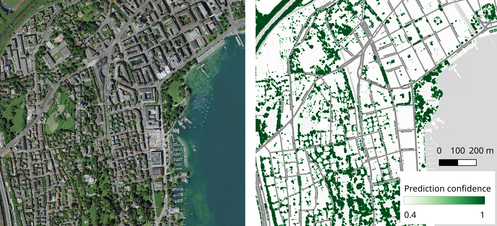

# Restor Foundation Tree Crown Delineation Pipeline


[](https://github.com/Restor-Foundation/tcd-pipeline/actions/workflows/python-test.yml)
[](https://github.com/Restor-Foundation/tcd-pipeline/actions/workflows/docker.yml)
This repository contains a library for performing tree crown detection (TCD) in aerial imagery.

**Note: we are currently refactoring the reporting scripts to bring them in line with changes to the API - we recommend using external software to analyse and collate predictions (e.g. output shapefiles and GeoTIFF confidence maps).**

## Citation

If you use this pipeline for research or commercial work, we would appreciate that you cite (a) the dataset and (b) the release paper as appropriate.

[ citation here ]

## Dataset and pre-trained models

The training dataset used for our models is currently hosted on [HuggingFace Hub](https://huggingface.co/datasets/restor/tcd). We also provide the dataset pre-formatted as MS-COCO on [Zenodo]() which can be used for training instance segmentation models out-of-the-box. These datasets can also be reconstructed using the HuggingFace repository.



The repository supports Mask-RCNN for instance segmentation and a variety of semantic segmentation models - we recommend Segformer as a default, but we also provide trained UNets which are more permissively licensed. Models will be downloaded automatically when you run prediction for the first time, so there's no need to handle checkpoints manually. You can of course fine-tune your own models using the pipeline and provide local paths if you need.

Have a look at our [model zoo](https://huggingface.co/restor).

## Installation

For complete installation information, have a look at our documentation [here]().

However, for a quick start we recommend you use Conda:

```bash
# Clone the repository
git clone github.com/restor-foundation/tcd

# Install and activate the conda environment
conda env create -n tcd -f environment.yml
conda activate tcd

# Install the pipeline package
pip install -e .[test,docs]

# Run unit tests to verify
pytest
```

### Docker

We also provide pre-built docker containers with dependencies and the library pre-installed:

```bash
docker run --it -rm <>
```

## Documentation

For technical information, please see our release [paper]().

Comprehensive documentation may be found [here]() - we use `mkdocs` to generate documentation and you can also find it in markdown format in the `docs` folder in the repository. You can build/serve by running:

```bash
mkdocs serve
```

## Post-install and testing

Running the test suite is a comprehensive check of the entire pipeline - currently at around 70% code coverage.

We provide a simple test image in the repo that you can use to check if everything is installed correctly.

## Single image prediction

We've tried to make using the pipeline and models as simple as possible. To predict an image, you can run:

```bash
python predict.py [instance, semantic] <path-to-image> <result-folder>
```

for example:

```bash
python predict.py semantic data/5c15321f63d9810007f8b06f_10_00000.tif results_semantic
python predict.py semantic data/5c15321f63d9810007f8b06f_10_00000.tif results_instance
```

which will run the pipeline on the test image in semantic and instance segmentation modes. The results are saved to the output folders which include: geo-referenced canopy masks, shapefiles with detected trees and canopy regions and overlaid visualisations of the predictions.

## License

This repository is released under the Apache 2.0 license which permits a wide variety of downstream uses. While you do not have to, we politely request that you acknowldege the code and/or models if you use them!

### Models

Currently our models are released under a CC BY-NC 4.0 license. We are retraining models on _only_ the CC-BY 4.0 imagery so that we can confidently use the same license.

### OAM-TCD Dataset

For license information about the dataset, see the [dataset card](). The majority of the dataset is licensed as CC-BY 4.0 with subsets CC BY-NC 4.0 (train and test) and CC BY-SA 4.0 (test only).

### SegFormer

The Segformer architecture from NVIDIA is provided under a research license. This does not allow commercial use without permission from NVIDIA - see [here](https://www.nvidia.com/en-us/research/inquiries/) - but you are free to use these models for research. **If you wish to use our models in a commercial setting, we recommend you use the UNet variants which still perform well.**

## Acknowledgements

This project is a collaboration between Restor and ETH Zurich, supported by a Google.org AI for Social Good grant: TF2012-096892, _AI and ML for advancing the monitoring of Forest Restoration_.
