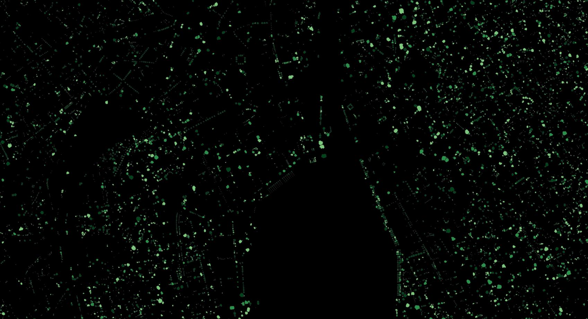

# Restor Foundation Tree Crown Delineation Pipeline


[](https://github.com/Restor-Foundation/tcd-pipeline/actions/workflows/python-test.yml)
[](https://github.com/Restor-Foundation/tcd-pipeline/actions/workflows/docker.yml)


_Tree instance predictions over Zurich using our Mask-RCNN model._

This repository contains a library for performing tree crown detection (TCD) in aerial imagery.

## Dataset and pre-trained models

The training dataset used for our models is currently hosted on [HuggingFace Hub](https://huggingface.co/datasets/restor/tcd). We also provide the dataset pre-formatted as MS-COCO on [Zenodo](https://zenodo.org/record/11617167) which can be used for training instance segmentation models out-of-the-box. These datasets can also be reconstructed using the HuggingFace repository.


_Example predictions using one of our SegFormer-based models to predict canopy coverage over Zurich. Left: RGB image, Swisstopo/SwissIMAGE 10cm (2022), Right: Predictions from restor/tcd-segformer-mit-b5. Base map tiles by Stamen Design, under CC BY 4.0. Data by OpenStreetMap, under ODbL._

The repository supports Mask-RCNN for instance segmentation and a variety of semantic segmentation models - we recommend Segformer as a default, but we also provide trained UNets which are more permissively licensed. Models will be downloaded automatically when you run prediction for the first time, so there's no need to handle checkpoints manually. You can of course fine-tune your own models using the pipeline and provide local paths if you need.

Have a look at our [model zoo](zoo.md).

## Installation

For complete installation information, have a look at our documentation [here]().

However, for a quick start we recommend you use Conda:

```bash
# Clone the repository
git clone github.com/restor-foundation/tcd

# Install and activate the conda environment
conda env create -n tcd -f environment.yml
conda activate tcd

# Install the pipeline package
pip install -e .[test,docs]

# Run unit tests to verify
pytest
```

### Docker

We also provide a docker container with dependencies and the library pre-installed:

```bash
docker pull ghcr.io/restor-foundation/tcd:main
```

## Colab Notebook

For an example of loading our dataset and running a prediction without using the pipeline, have a look at [this notebook](https://colab.research.google.com/drive/1N_rWko6jzGji3j_ayDR7ngT5lf4P8at_).

## Documentation

For technical information, please see our release [paper]().

Comprehensive documentation may be found [here]() - we use `mkdocs` to generate documentation and you can also find it in markdown format in the `docs` folder in the repository. You can build/serve by running:

```bash
mkdocs serve
```

## Post-install and testing

Running the test suite is a comprehensive check of the entire pipeline - currently at around 70% code coverage, from the root directory you can run pytest:

```bash
pytest
```

We provide a simple test image in the repo that you can use to check if everything is installed correctly.

## Single image prediction

We've tried to make using the pipeline and models as simple as possible. Once you've installed the repository, you can run:

```bash
tcd-predict <model> <path-to-image> <result-folder>
```

for example:

```bash
tcd-predict semantic data/5c15321f63d9810007f8b06f_10_00000.tif results_semantic
tcd-predict semantic data/5c15321f63d9810007f8b06f_10_00000.tif results_instance
```

which will run the pipeline on the test image in semantic and instance segmentation modes. The results are saved to the output folders which include: geo-referenced canopy masks, shapefiles with detected trees and canopy regions and overlaid visualisations of the predictions. If you want to change models, just specify the name of the model as on HuggingFace e.g. `restor/tcd-segformer-mit-b3`.

The `tcd-predict` and `tcd-train` scripts are installed as part of the library. However you can also call the scripts directly - they are symlinked in the root of the repository folder, or you can find them in `src/tcd-pipeline/scripts`.

### Screen prediction

We provide a fun demo script which will run a model on a live screen capture. `screen_predict.py` lives in the `tools` folder:

```python
pip install python-opencv mss
python tools/screen_predict.py semantic
```

The script works best on dual monitor setups where you can view the output on one screen and move around on the other, but it will work on smaller screens just fine. You may need to adjust the grab dimensions to suit your hardware, in the script:

```python
mon = {"left": 0, "top": 0, "width": 1024, "height": 1024}
```

Tips:

- The script has no idea about resolution, so you may need to zoom in/out to find the sweet spot. Remember the models are optimised for 0.1 m/px
- If you pick a region that's outside the bounds of your monitor, the script will probably segfault - so if that happens, double check the region settings above
- Try browsing the web (for example go on OpenAerialMap and zoom in)

## Citation

If you use this pipeline for research or commercial work, we would appreciate that you cite (a) the dataset and (b) the release paper as appropriate. We will update the citation with details of the preprint and/or peer-reviewed manuscript when released.

```bibtex
@unpublished{restortcd,
  author = "Veitch-Michaelis, Josh and Cottam, Andrew and Schweizer, Daniella Schweizer and Broadbent, Eben N. and Dao, David and Zhang, Ce and Almeyda Zambrano, Angelica and Max, Simeon",
  title  = "OAM-TCD: A globally diverse dataset of high-resolution tree cover maps",
  note   = "In prep.",
  month  = "6",
  year   = "2024"
}
```


## Contributing

We welcome contributions via pull request. Please note that we enforce the use of several pre-commit hooks, namely:

- Code formatting uses `black`
- We use `isort` to sort imports
- There is a maximum size for checked in files so the repository doesn't get bloated
- We clear Jupyter notebooks to avoid bloat and big diffs

If you submit a PR, please ensure that the test suite passes beforehand and if you add new features/functionality, please try to add unit tests.

If you'd like help improve the labels in our dataset, you can take part as a citizen scientist via our [Zooniverse campaign](https://www.zooniverse.org/projects/physicsjosh/tag-trees).

## Troubleshooting

If run into problems using the pipeline, please create an issue providing as much detail as possible - including the script that you're trying to run. The more detail you can provide, the better we can help!

Similarly please don't hesitate to suggest new features that you think would be useful, though we can't guarantee that all feature requests will be possible.

## License

This repository is released under the Apache 2.0 license which permits a wide variety of downstream uses.

### OAM-TCD Dataset

For license information about the dataset, see the [dataset card](https://huggingface.co/datasets/restor/tcd).

The majority of the dataset is licensed as CC-BY 4.0 with a subset as CC BY-NC 4.0 (train and test) and CC BY-SA 4.0 (test only). These two less 
permissive image classes consititute around 10% of the dataset.

The dataset DOI is: `10.5281/zenodo.11617167`.

### Models

Currently our models are released under a CC BY-NC 4.0 license. We are retraining models on _only_ the CC-BY 4.0 imagery so that we can confidently use the same license.

Model usage must be attributed under the terms of the CC-BY license variants.

#### Mask-RCNN

To train Mask-RCNN (and other instance segmentation models), we use the Detectron2 library from FAIR/Meta which is licensed as Apache 2.0.

#### Segmentation Models Pytorch (SMP)

UNet model implementations use the [SMP library](https://segmentation-modelspytorch.readthedocs.io/), under the MIT license.

#### SegFormer

The Segformer architecture from NVIDIA is provided under [a research license](https://huggingface.co/docs/transformers/model_doc/segformer).

This does not allow commercial use without permission from NVIDIA - see [here](https://www.nvidia.com/en-us/research/inquiries/) - but you are free to use these models for research. **If you wish to use our models in a commercial setting, we recommend you use the Mask-RCNN/U-Net variants (or train your own models with your preferred architecture).**

## Acknowledgements

This project is a collaboration between Restor and ETH Zurich, supported by a Google.org AI for Social Good grant: TF2012-096892, _AI and ML for advancing the monitoring of Forest Restoration_.
