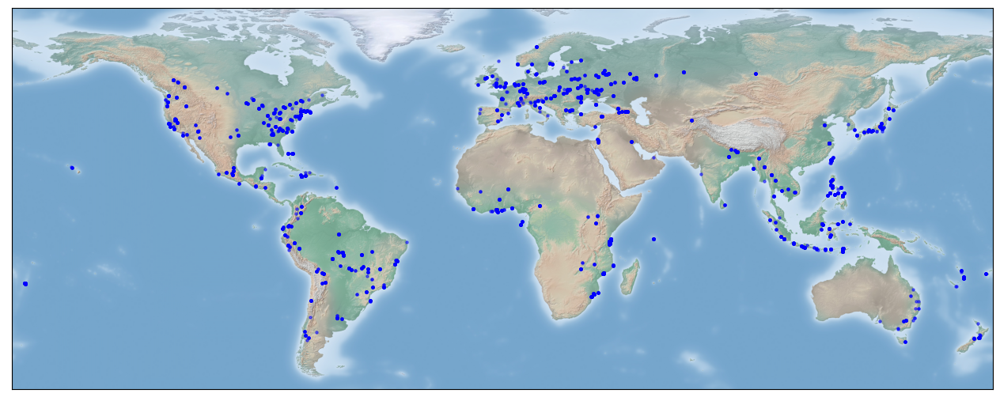

# OAM-TCD Dataset Card

A dataset card may also be found on the [HuggingFace repository](https://huggingface.co/datasets/restor/tcd), where the data are hosted.

## Overview

This dataset contains over 5000 high resolution (10 cm/px) aerial images with annotated tree coverage.

Images were sourced from Open Aerial Map data and are globally stratified providing much better scene diversity than contemporary datasets in the literature. A plot of image distribution is shown below, point colour indicates the validation fold used for each image:



Please make sure you read the Limitations section before using our models for actionable tasks; it's important to understand how and when models are likely to fail.

## Conversion to MS-COCO

If you want to train models using this pipeline, you need to convert the dataset to MS-COCO format. We provide a utility to do this, assuming you are in the root directory of the repository and you have activated a suitable environment:

```bash
python tools/generate_dataset.py restor/tcd <output-path> --folds
```

If you just want to run the export without creating the python environment, you need the `datasets` and `pycocotools` libraries installed. `pycocotools` is used for sanity checking the export.

The generator will create the folder that you specify and inside, at least, a `holdout` directory which contains the full training and test splits. Subfolders for `images` and `masks` will also be created. If you specify the `folds` option, then the image and mask folders will by symlinked to save space. The holdout folder will contain a `train.json` and `test.json`, while the cross-validation folders will contain `train.json` and `val.json`.

To combine datasets, provide multiple identifiers. For example here we generate the "full" dataset, training on CC BY and CC BY-NC imagery:

```bash
python tools/generate_dataset.py --folds restor/tcd restor/tcd-nc restor/tcd-sa <output-path>
```

The initial generation will take some time to dump all the images, but fold generation is a lot faster as the images are linked from the first pass.

### Using the non-commercial images

The `restor/tcd` repository contains only `CC BY 4.0` licensed images.

We have specified all `CC BY-SA 4.0` imagery to be `test` images due to the risk of incompatible license terms. If you want to also train on the `CC BY-NC 4.0` imagery, which adds ~200 more training images, you can do so (for example if you are using the models for research purposes). We declare models trained in this way as `CC BY-NC 4.0` as a legally conservative option, and to respect rightsholders.

By default we give instructions for training only on `CC BY 4.0` as this is the most permissive and recommended option for most users.

## Supported Tasks and Benchmarks

The dataset can be used to train instance and semantic segmentation models. In principle you can also train panoptic segmentation models, but the images are not completely annotated (e.g. only trees are labelled).

Results below refer to `holdout/test` set evaluation:

### Instance segmentation

| Model Architecture  | Model Tag | mAP50 |
| ------------------  | --------- | --------- |
| Mask-RCNN[^1] Resnet34  | `restor/tcd-mask-rcnn-r34` | TBD |
| Mask-RCNN Resnet50  | `restor/tcd-mask-rcnn-r50` | **43.22** |
| Mask-RCNN Resnet101 | `restor/tcd-mask-rcnn-r101` | TBD |

### Semantic segmentation

Our baseline models are hosted on hugging face:

| Model Architecture | Model Tag | Accuracy  | F1       | IoU     |
| ------------------ | --------- | --------- | -------- | ------- |
| U-Net[^2] ResNet34      | `restor/tcd-unet-r50`         | 0.883 | 0.871 | 0.838 |
| U-Net ResNet50      | `restor/tcd-unet-r50`         | 0.881 | 0.880 | 0.849 |
| U-Net ResNet101     | `restor/tcd-unet-r101`         | **0.900** | 0.886 | 0.856 |
| Segformer[^3] mit-b0   | `restor/tcd-segformer-mit-b0` | 0.892 | 0.882 | 0.865 |
| Segformer mit-b1   | `restor/tcd-segformer-mit-b1` | 0.897 | 0.891 | 0.870 |
| Segformer mit-b2   | `restor/tcd-segformer-mit-b2` | 0.889 | 0.898 | 0.871 |
| Segformer mit-b3   | `restor/tcd-segformer-mit-b3` | 0.884 | 0.901 | 0.875 |
| Segformer mit-b4   | `restor/tcd-segformer-mit-b4` | 0.891 | 0.901 | 0.875 |
| Segformer mit-b5   | `restor/tcd-segformer-mit-b5` | 0.890 | **0.902** | **0.876** |

### Benchmark datasets

Details of benchmarking can be found in our paper and the pipeline respository. Initially we report results on the following open data:

- Cross-validation on the TCD dataset itself, validation fold indices are provided in this repository.
- Performance on OAM-TCD holdout split
- Semantic and instance segmentation are tested on 2022 [10cm Swisstopo Swissimage](https://www.swisstopo.admin.ch/en/orthoimage-swissimage-10) imagery over Zurich, using the [municipal tree inventory](https://www.stadt-zuerich.ch/ted/de/index/gsz/planung-und-bau/inventare-und-grundlagen/baumkataster.html) and LIDAR [canopy height model](https://www.stadt-zuerich.ch/geodaten/download/Baumhoehen_2022__CHM_aus_Lidar_) for comparison
- [WeRobotics Open AI Challenge](https://docs.google.com/document/d/16kKik2clGutKejU8uqZevNY6JALf4aVk2ELxLeR-msQ/edit), a post-disaster image captured in Tonga which has keypoint annotations for several tree species

## Data format

Images were sourced from Open Aerial Map via a stratified sampling approach. We binned the world into 1 degree square regions and iteratively sampled images from each bin. Tiles were then randomly sampled from each image, with a threshold on the number of valid pixels. The total number of images/image tiles was largely chosen by budgetary constraints. Each tile is 2048 x 2048 pixels at 10 cm resolution. This allows for flexibility in training - by resampling the images, it is possible to train images at varying ground sample distances and with different context sizes.

We provide images as GeoTIFF, but suggest that users convert to JPEG prior to training as dataloading can be significantly faster. Images should be treated as RGB format; there are no multi-spectral bands in the data, or LIDAR, etc. While these additional data sources can be very useful for tree canopy segmentation, many conservation and restoration practitioners do not have access to the necessary sensors.

Each image is accompanied by instance segmentation annotations, and derived panoptic segmentation maps encoded using COCO conventions (see `rgb_to_id` and `id_to_rgb`). The dataset currently contains two classes: tree and tree-canopy. These segmentation maps can be binarised for semantic segmentation (e.g. tree/no-tree). Depending on the complexity of the annotation, instance polygons are provided as either a "simple" xy sequence, or a RLE encoded mask. We also provide a copy of Open Aerial Map's metadata for the source image for each tile, as a reference. This metadata was used to determine the usage license for each image. For users wishing to train models with transformers, the mask images and bounding boxes should be sufficient.

This repository contains MS-COCO formatted annotation files (`train.json` and `test.json`) that can be used with popular object detection frameworks and we provide a script to generate training data folds to recrate the cross-validation in our paper. Otherwise, the intention is that users can use HuggingFace datasets to load the dataset and train models within the `transformers` and `datasets` frameworks.

## Classes

Labels have two classes (plus background): (individual) tree and tree canopy.

It is very difficult for untrained annotators to identify boundaries between trees that are touching (closed canopy) without other sensing methods like LIDAR or multi/hyper spectral imaging. Since it would likely be detrimental to model training to only annotate identifiable individual trees, we asked annotators to label individual and groups of trees separately. 

Operationally, there are two use-cases we targeted for restoration monitoring:

- Identify individual trees in open canopy, such as in early stage projects
- Assess overall canopy cover (as a percentage)

When trees are planted, they tend to be well-spaced and it takes some time for the canopy to fully close. We can therefore aim to identify individual tree locations from aerial imagery and track crown size and growth over time, using multiple surveys. Once the canopy closes, it is generally more helpful to quantify canopy coverage overall - the exact number of trees is less important (a simple estimate for tree count is to divide canopy area by the average crown area). Other monitoring protocols typically include canopy height or the distribution of vegetation height, but this is normally obtained via full-waveform LIDAR scanning or photogrammetry.

We may add additional classes to the dataset in the future, for example buildings or terrain features that may help improve models.

## Splits

Since the annotation cost of each image is relatively high, we opted for a cross-validation approach that would allow models to take advantage of more images during training. We provide 5 data splits and a holdout set. Split is stratified by biome, so each should contain roughly the same proportion of images from similar environmental conditions (such as temperate and rainforest). The generation notebook for the splits is in our pipeline repository. After cross-validation we train on the entire training set and evaluate on the holdout or test split. 

You can use the [select](https://huggingface.co/docs/datasets/v2.19.0/en/package_reference/main_classes#datasets.Dataset.select) command in `datasets` to split images into cross-validation folds:

```python
from datasets import load_dataset

ds = load_dataset("restor/tcd", split="train")
fold = 0

val_fold_idx = dataset["train"]["validation_fold"]
train_indices = [i for (i, v) in enumerate(val_fold_idx) if v != fold and v >= 0]
val_indices = [i for (i, v) in enumerate(val_fold_idx) if v == fold and v >= 0]

val = dataset["train"].select(val_indices)
train = dataset["train"].select(train_indices)
```

This approach is significantly less memory-intensive (and faster) than using `Dataset.filter`.

## Pipeline

Our pipeline repository provides exemplary training and evaluation code, as well as a comprehensive workflow for processing large orthomosaics. It was used to generate results in the initial release paper and has been tested operationally. It is under active development and we encourage the community to contribute if they are able.

## Annotations

Annotations were sourced primarily from professional annotators who were not ecology experts. After labelling, annotations were reviewed by Restor staff to flag obvious errors. Annotators were instructed to label every tree they could individually identify in an image; if they were unable to identify the canopy boundary, or if there were multiple trees that were difficult to disambiguate, the region should be marked as canopy.

There are some edge cases in the data, such as hedgerows in urban environments and we are still reviewing labels to improve their consistency. Over time, we hope to "upgrade" a significant proportion of the canopy labels to individual trees (for example, all palms) which should improve instance segmentation results.

Since we do not have ground truth for the data, there is some inherent subjectivity in the labels. However, when treated as a semantic segmentation dataset (e.g. to map tree cover), we believe that the dataset is generally very consistent and this is backed-up by good agremeent on independent test data. For instance segmentation, we have trained models that also perform well but we advise that they be used for open canopy tree mapping only.

## Crowdsourced tree labels

As an additional experiment, we have begun to crowdsource labels for trees via the Zooniverse platform. We ask volunteers to simply "tag" tree locations - i.e. click on all the trees they can identify confidently. We do not ask volunteers to label inside closed canopy (arbitrarily, where more than 5-6 trees are touching). Dataset images were tiled with overlap so that users were not presented with overly large images. The project has a retirement rate of 20, meaning each image tile is reviewed by at least 20 different annotators. The goal is to use "tag count" as a proxy for confidence for a large subset of tree labels and also to attempt to identify labels which cover multiple trees.

[zooniverse image]

This campaign is ongoing and so far we have additional annotations for approximately 1/3 to 1/2 of the full dataset.

## Limitations

### Tree detection in closed canopy

We make it quite explicit that our model does not delineate dense groups of trees that are touching (closed canopy). In the future, we hope to "upgrade" our canopy labels to better support this, but currently you should not use our models for things like tree counting in closed canopy forest.

You may be able to post-process semantic segmentation predictions to do this; this is viable for regularly planted stands (e.g. palm plantations) and some more information may be found in [( et al.)]().

### Under-represented biomes

We're quite proud of how diverse our dataset is, but there are still gaps. In particular the following biomes have few to no examples in the data : . This is the result of two things: first, that we did not initially sample data by biome and second, the distribution of imagery in the OAM archives probably has few images from these locations (or we sample from the location, but chose another biome).

A "todo" for the future is to add more images from these biomes, but we strongly encourage you to perform an independent validation of our models on your data before deploying. It's quite likely that the models will work well over most of the world, but there will be exceptions.

### Adversarial examples

Or "things that look like trees, but are not".

Because the models work on RGB data alone, it's possible that you will get confident predictions for regions or objects that are not trees. The best way to mitigate this is to use combinations of data - for example, you could use an additional canopy height model to filter predictions that are above a confidence threshold _and_ above a certain height. We do recommend that you filter instance segmentation predictions using semantic segmentation (see our prediction code) which is - from our own experimentation - a very effective way to remove false positives. The justification is that the semantic segmentation models are better at predicting tree/no-tree.

## Contact

If you have a question about this dataset or any of its contents, please contact `josh [at] restor.eco`. If you believe your rights have been infringed, for example if one of your images has been used here and you do not believe it should be included, please let us know.

## License

Our main annotations are provided as CC BY 4.0. Images are provided using the declared license from Open Aerial Map. In the majority of cases, this is also CC BY, however some images have CC BY-NC licenses so be aware that if you intend to use this dataset for commercial purposes, you should exclude those images from your work - images with CC BY-NC and CC BY-SA licenses are stored in separate repositories.. The accompanying training and prediction pipeline is provided under an Apache 2.0 license.

[^1]: He, K., Gkioxari, G., Dollár, P., & Girshick, R. (2017). [Mask R-CNN](https://arxiv.org/abs/1703.06870). In Proceedings of the IEEE international conference on computer vision (pp. 2961-2969).
[^2]: Ronneberger, O., Fischer, P., Brox, T. (2015). [U-Net: Convolutional Networks for Biomedical Image Segmentation.](https://doi.org/10.1007/978-3-319-24574-4_28) In MICCAI 2015. Lecture Notes in Computer Science, vol 9351. Springer, Cham. 
[^3]: Xie, E., Wang, W., Yu, Z., Anandkumar, A., Alvarez, J. M., & Luo, P. (2021). [SegFormer: Simple and efficient design for semantic segmentation with transformers.](https://arxiv.org/abs/2105.15203) Advances in neural information processing systems, 34, 12077-12090.
