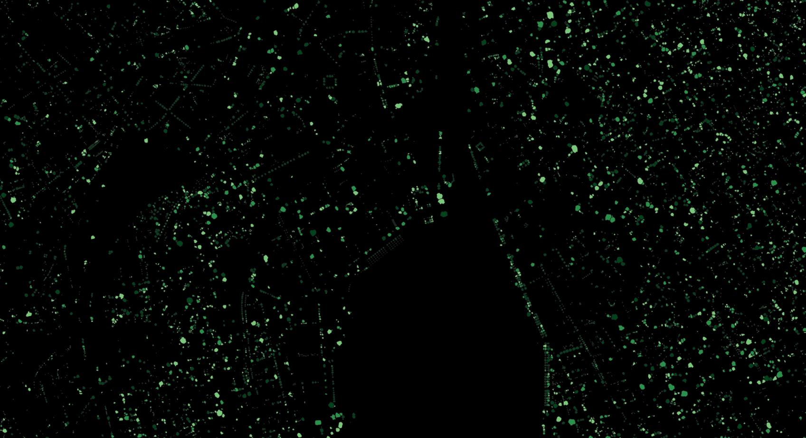

# TCD Pipeline Documentation


[](https://github.com/Restor-Foundation/tcd-pipeline/actions/workflows/python-test.yml)
[](https://github.com/Restor-Foundation/tcd-pipeline/actions/workflows/docker.yml)

Researchers at Restor and ETH Zurich have developed this powerful and easy-to-use pipeline for detecting individual trees and tree canopy in aerial images. You can also explore our open-access dataset of labelled trees which may be useful for training your own models or benchmarking against other methods.


_Trees detected from aerial imagery over the city of Zurich_

Head over to the [introduction](introduction.md) page for general inforamtion about the project.

For more information about using our models and pipeline:

- [How to install the pipeline](install.md)
- [Predicting tree cover in images](prediction.md)
- [Training your own models](training.md)
- [Exporting models for production deployment](deployment.md)
- [Sample model card](model.md)
- [Datasets and data formats](datasets.md)
- [Benchmarking](benchmark.md)
- [Output caching](cache.md)
- [Pipeline architecture](architecture.md)
- [API/developer reference](reference.md)

## Quickstart

This quickstart assumes that you have Conda installed. Open a terminal and

First, clone the repository:

```bash
git clone github.com/restor-foundation/tcd
cd tcd
```

Then, install the conda environment and install the pipeline:

```bash
conda env create -f environment.yml
pip install -e .[test]
```

And run a test prediction on sample data in the repo:

```bash
tcd-predict semantic input=data/5c15321f63d9810007f8b06f_10_00000.tif output=test_prediction
```
