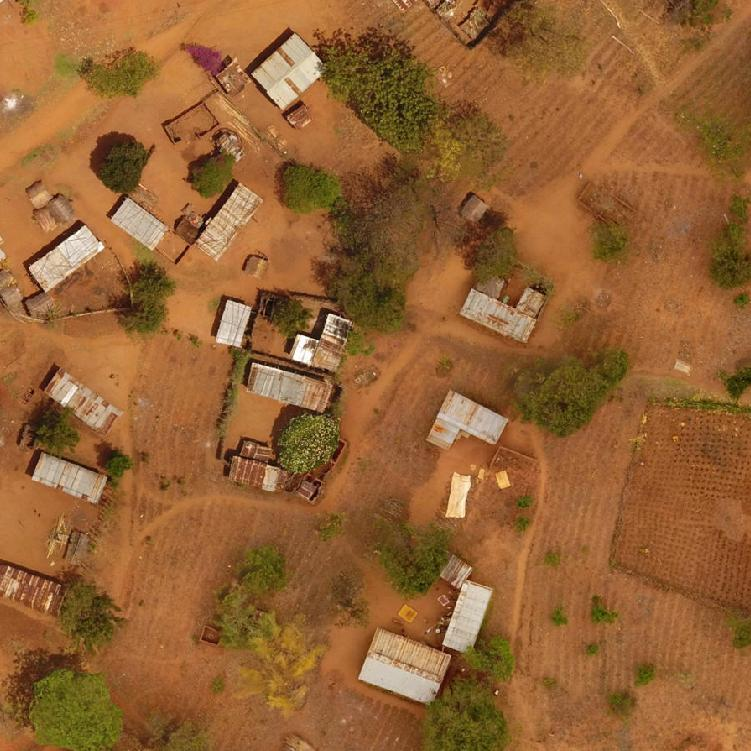
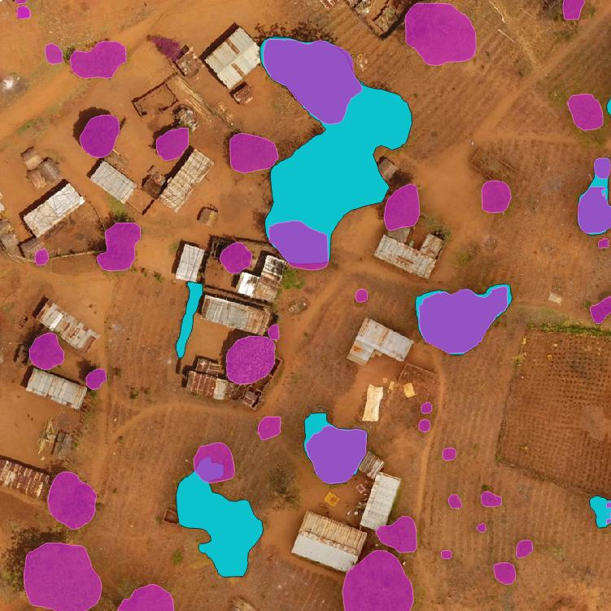
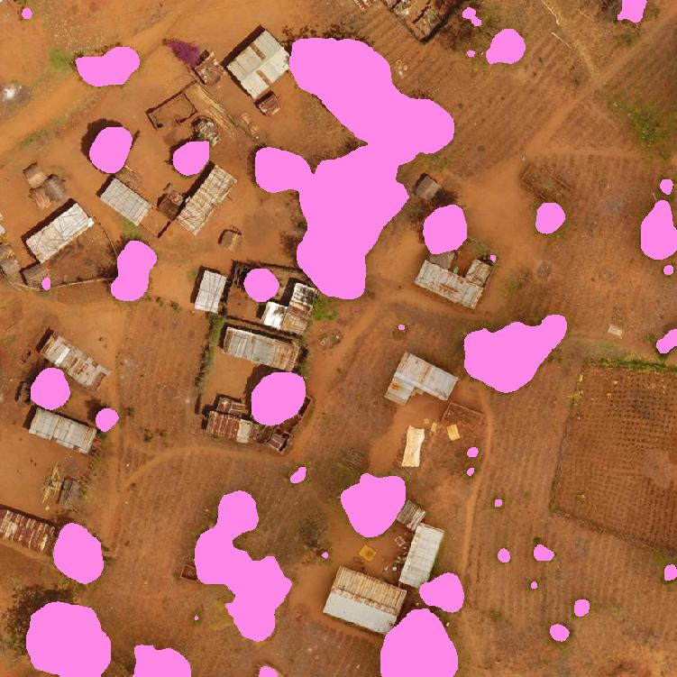
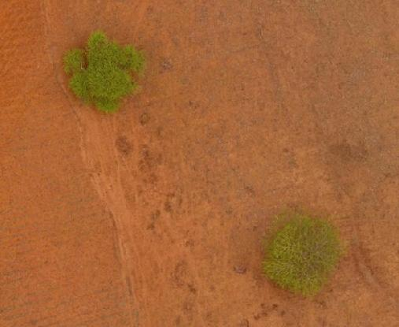
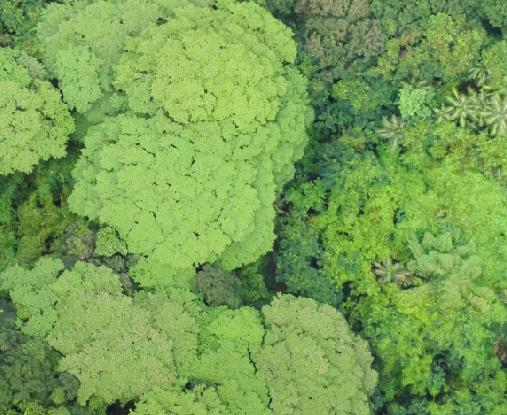
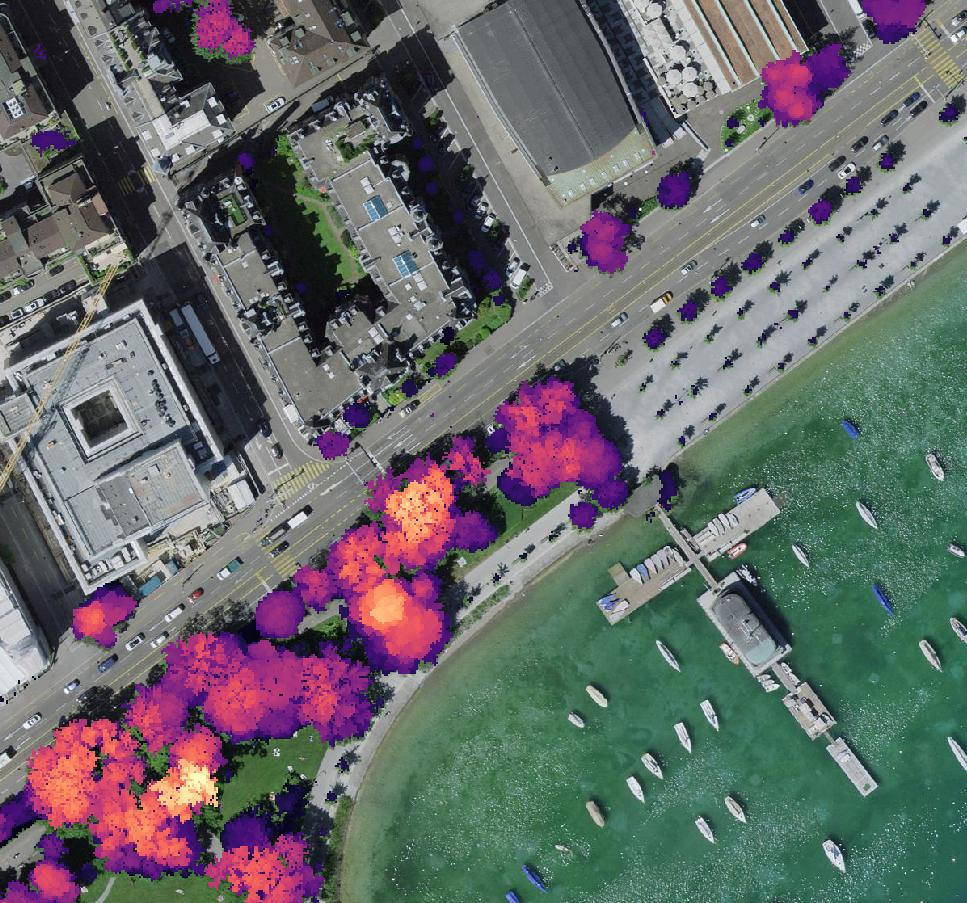
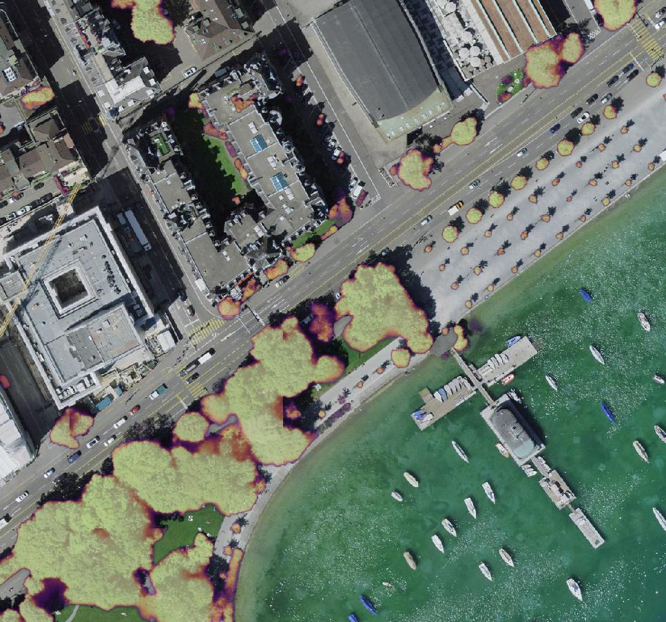
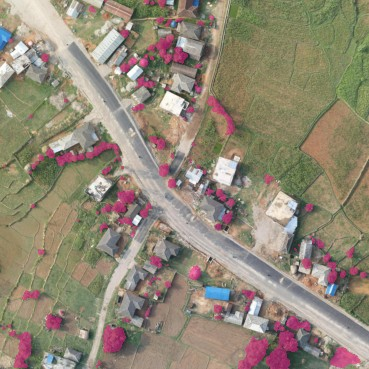
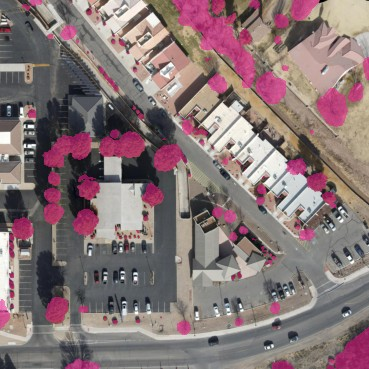

# Getting Started

Researchers at Restor and ETH Zurich have developed this powerful, but easy-to-use, pipeline for detecting individual trees and tree canopy in aerial images. You can also explore our open-access dataset of labelled trees which may be useful for training your own models or benchmarking against other methods.

If you just want to start mapping trees, [jump here](prediction.md).

For more information about using our models and pipeline:

- [How to install the pipeline](installation.md)
- [Predicting tree cover in images](prediction.md)
- [Training your own models](training.md)
- [Exporting models for production deployment](deployment.md)
- [Datasets and data formats](datasets.md)
- [Pipeline architecture](architecture.md)
- [API/developer reference](reference.md)

## What can I detect?

From talking to many restoration practitioners, potential users and other researchers, we identified two needs in the community:

- **Individual tree detection**: you want to identify every tree on your site and perhaps analyse crowns or other traits
- **Canopy coverage estimation**: you want to assess what area of your site is covered by tree canopy

=== "RGB Image"

    

=== "Instance Segmentation"

    

=== "Semantic segmentation"

    

_A comparison of the two types of outputs the pipeline can produce. The image was captured over a location in Tanzania, provided by Justdiggit. First, is an instance segmentation prediction - pink regions are individually detected trees, blue are regions of connected/closed canopy trees. Second is a semantic segmentation prediction, showing binary per-pixel tree classification._

## What is a tree?

In order to train a model to perform "tree detection", you need labelled data and that means you need to find annotators and give them instructions. The first problem you'll likely encounter is that there is no single definition of "tree".

It is remarkably difficult to universally define what a tree is, aside from a list of hugely diverse species that people have decided are "trees". For a start, trees are not a [_clade_](https://en.wikipedia.org/wiki/Clade) - species that we call "trees" do not share a common ancestor. Wikipedia gives a simple definition:

> In botany, a tree is a perennial plant with an elongated stem, or trunk, usually supporting branches and leaves.

Some practical definitions you might find in the literature include plants with a crown area larger than some threshold, or species taller than some height and so on. The gold standard for this sort of measurement is LIDAR, which can accurately measure height above ground, but even LIDAR data must be classified and clustered. Other definitions that relate to the growth of the trunk (i.e. tree rings) may exclude species like palms and bananas that many people would consider to be trees for the purpose of aerial mapping.

The upshot of this is that unless your model predicts species, it is extremely hard to accurately - and globally - quantify tree cover. Our models can detect things that annotators determined looked like trees, but in practice we found that even non-expert annotators can consistently label tree cover. Even though there are mislabeled regions in the dataset, overall the models work well when evaluated on independent imagery that was not used for training.

## What is a tree crown?

The tree crown is, roughly, everything that is aboveground that extends outwards from the trunk. Looking from above, it is the visible extent of the tree.

<figure markdown="span">
  
  <figcaption>Two tree crowns viewed from above</figcaption>
</figure>

## What is canopy?

For the sake of this software, tree canopy is a collection of crowns that may or may not be touching. If the tree crowns are not touching, we call this **open canopy**. If they touch, this is **closed canopy**.

A very common metric used in ecosystem restoration and measurement is **canopy coverage** which describes _how closed_ the canopy is. If you stand on the ground and look upwards, the **closure** is the percentage of sky that is obscurved by leaves over the whole hemispheric field of view. If you vertically project the cover, that's **coverage**

<figure markdown="span">
  
  <figcaption>This crop, taken from one of the images in our annotated dataset shows dense tree canopy - challenging for models to delineate.</figcaption>
</figure>

In an image, we define canopy coverage to be the percentage of pixels that are classified as "tree" (technically, tree crown).

Unsurprisingly there are also a lot of slightly different definitions of [canopy coverage](http://openknowledge.nau.edu/id/eprint/1273/7/Egan_2010_ERIFactSheet_CanopyCover(1).pdf).

## Individual delineation in closed canopy

The holy grail of tree crown delineation is to accurately identify the boundary of every tree in a canopy that is fully closed. However, this is an incredibly difficult task because it is often very difficult to identify where one tree stops and another begins.

Other research uses multi-modal data such as full waveform LIDAR and multi/hyperspectral imaging, but this sort of rich data isn't always available. Some datasets/models, like Detectree do not label every tree in the training data and find that this provides acceptable results on new data.

There are some cases where it is very possible to identify every tree in a closed canopy, for example homogenous/monoculture plantations where every tree has a similar crown structure. This is the case with palm trees, but here you could use a much simpler model.

Detecting individual species (or family) is another exciting prospect, but this is also quite challenging to do with RGB imagery alone.

Within the context of restoration, it is debatable whether "counting trees" is really necessary to assess the progress of a project. In some monitoring protocols, like [Pacto](https://bioone.org/journals/tropical-conservation-science/volume-10/issue-1/1940082917697265/Protocol-for-Monitoring-Tropical-Forest-Restoration--Perspectives-From-the/10.1177/1940082917697265.full), a coverage threshold is the main metric for establishing whether a project is successful (Pacto uses 70% as an initial target in Brazil). The best monitoring protocols combine lots of different metrics to assess the health of an ecosystem and trees are just one component.

## Compared to LIDAR and photogrammetry

LIDAR is an active sensing technique that uses laser rangefinding to construct a 3D representation of the scanned scene. The advantage of LIDAR is that false positive measurements are fairly low, if good outlier rejection is applied to the data. You are unlikely to confuse a patch of open field as a tree. Since LIDAR is a distance measurement, it is possible to produce Canopy Height Maps (CHMs) and, from those, directly extract tree crowns using a variety of algorithms. These algorithms are normally tailored to species, such as palms or conifers. Unsurprisingly, LIDAR data is very good for distinguishing vegetation based on height, so you're less likely to confuse undergrowth or shrubs as mature trees.

The main downside of LIDAR is accessibility, expense and additional processing requirements. Commodity LIDAR sensors like the Zenmuse L1 produce good results at relatively low cost, but the point cloud quality can be variable (canopy penetration is poor in dense forest). LIDAR waveform data is usually proprietary and requires processing before an XYZ point cloud can be created. The data itself are large, as every point contains a lot of metadata (in addition to location, the return intensity, return number, colour, etc). There are some excellent open source packages for working with LIDAR data, such as (PDAL)[https://pdal.io], but some experience is required to get good results.

RGB imagery is in many ways complementary. It is far more accessible as a technology - the imagery captured from a low-cost DJI Mavic drone can easily be as good as imagery captured from an expensive aerial survey. Open source processing is also mature, with tools like (Open Drone Map)[] for orthomosaic generation. From a modeling perspective, the downside is that models relying on colour and textural patterns can more easily be fooled by "things that look like trees" and it is hard to distinguish vegetation by height[^1]. On the other hand, optical imagery tends to be much higher resolution than LIDAR which can lead to better coverage mapping (as in the example below).

For more information about predicting height with RGB, you can look at the recent work by Facebook and WRI[^2].

When tested on an aerial image of the city of Zurich, our models agree with LIDAR canopy maps with around 90% accuracy and as you can see below, in some cases provides better delineation:

=== "LIDAR Canopy Map"

    

=== "RGB Semantic segmentation"

    

_These images show a comparison between LIDAR canopy height over the city of Zurich (provided by Swisstopo) and model confidence from our model, which was not trained on this imagery. You can see that while LIDAR can accurately map tree heights, the canopy is - in some places - better mapped by our model which predicts at a higher resolution and can identify smaller trees._.

## How do these models compare to DeepForest, Detectree, Treeformer...?

Our pipeline is complementary to most of the existing literature that has been published in tree detection.

1. We believe that our semantic segmentation models are state-of-the-art for binary tree detection in high resolution images, especially when considering how diverse our training dataset is.
2. We have published our dataset as open access which is one of the largest (in terms of ha of coverage) and most diverse of its kind (in terms of global image distribution)
3. Comparing instance segmentation models is more tricky. The main difference in our work is that we do not attempt to segment trees within closed canopy.

For comparison, we suggest to try the following packages:

- [DeepForest](https://deepforest.readthedocs.io) provides object detection models that return bounding box predictions. The models were trained on open data from North America (from the NEON project)
- [Detectree2](https://github.com/PatBall1/detectree2) supports instance segmentation, also via Mask-RCNN. The models are trained on imagery from rainforest and can delinate trees in closed canopy
- [Treeformer](https://github.com/HAAClassic/TreeFormer) is a keypoint detection model that tries to identify crown centres. It does not delineat trees, but could potentially work well in tandem with our semantic segmentation pipeline.
- [Meta's high resolution canopy height model](https://github.com/facebookresearch/HighResCanopyHeight) is available here, but a global [canopy map](https://meta-forest-monitoring-okw37.projects.earthengine.app/view/canopyheight) has been published which is likely easier to evaluate for most users.

There are lots of other examples in the literature, but we focus here on projects that are most relevant. Many studies only consider a very small area, a single species and/or do not release any code or imagery which makes them hard to evaluate. We recommend you read the papers accompanying these packages (as well as ours) to get an idea of the literature landscape.

## Data used to train our models

All of our currently released training data is sourced from Open Aerial Map and is licensed under Creative Commons. Due to some confusion and ambiguity OAM's documentation and distribution policy, we did include some CC-By-NC images in our dataset initially. We release the labels for these images, but you should ensure that you do not use models trained on these images for commercial purposes. These are, fortunately, a relatively small portion of the dataset and we are planning to upload re-trained models on the more permissive non-NC imagery.

Our approach is simple: we asked professional annotators to label a tree if they think it looks like one. We expect that this approach has high recall: annotators labelled everything that they were confident looked like a tree. Our ground truth shouldn't miss many trees (or at least regions covered by trees), but it's certain that some non-tree plants are included. Since it is difficult to label trees within closed canopy, we include a "group of trees" class to ensure that every tree pixel in the training data is labelled to the best of our ability. The quality of the masks in the dataset is generally high in terms of how tight the polygons delineate objects.

_Examples of labelled images from the TCD dataset - pink regions are annotated individual/groups of trees. The native resolution of these images is 2048x2048; the labels are detailed and accurate._

Unlike most of the existing public datasets for tree canopy mapping, our training data is global. Our intent from the start of the project was to produce models that were capable of predicting tree cover from any site in Restor's database, which spans the entire world. You should find that our models work well in most environments, but some biomes are still under-represented in the training data and in the future we hope to fill in those gaps.

You can download the dataset either from [HuggingFace](https://huggingface.co/datasets/restor/tcd), in Parquet format, or on Zenodo, in a more traditional MS-COCO format with annotations, images and semantic masks. The dataset card is also provided [here](data.md).

## How does this fit into my workflow/research/conservation strategy?

We released our models to the community as tools, but they are best integrated into larger monitoring frameworks and not used as standalone tools.

- Segmentation as a filter - our semantic segmentation models will effectively label every pixel in an image as "tree" or "not tree". This can be used to filter out areas of interest for further analysis.
- Assessing tree morphology in open canopy - this is a fairly common scenario for commercial agriculture; our models can be used to identify individual trees in orchards or other regularly planted environments. Unlike bounding box based methods, you can determine polygons for individual trees allowing you to accurately measure canopy area.
- Monitoring "binary" canopy cover - our models can be used to estimate canopy cover in a region. This is useful for monitoring restoration projects, or for assessing the impact of deforestation.

If you use our models for a cool project, we'd love to hear from you and we would be happy to provide a link here. Of course we also ask that if you use any of this work in an academic or publishable setting that you cite either the models, codebase or dataset as appropriate. You can find referencing information on the [citation](citing.md) page.

[^1]: The photogrammetric pipelines that stitch images into orthomosaics produce height maps as a byproduct of the mosacing process, but these are harder to convert to CHMs as you need to extract ground points (which, in dense forest, are much sparser).
[^2] Meta's press release provides a high level overview [here](https://research.facebook.com/blog/2023/4/every-tree-counts-large-scale-mapping-of-canopy-height-at-the-resolution-of-individual-trees/) and the paper (Tolan et al., 2024) is [here](https://www.sciencedirect.com/science/article/pii/S003442572300439X)